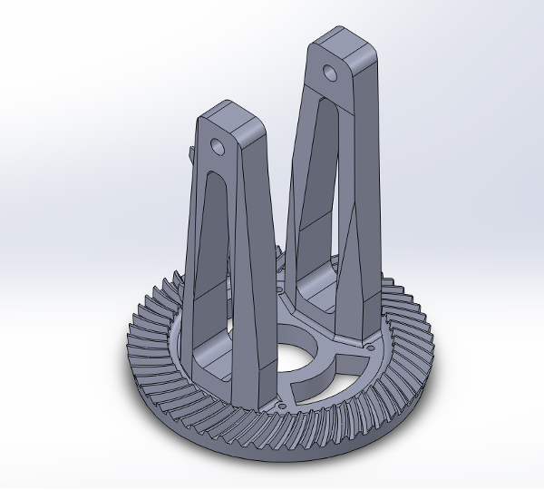
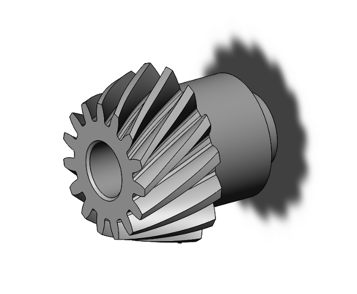
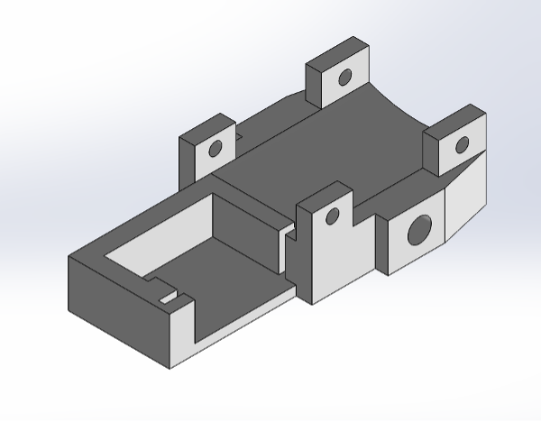
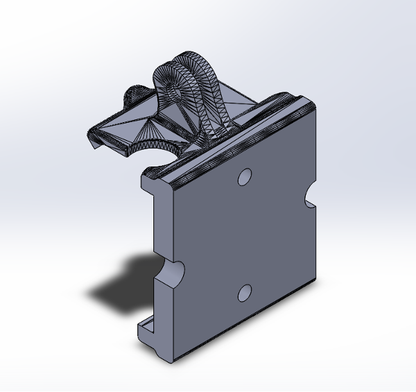
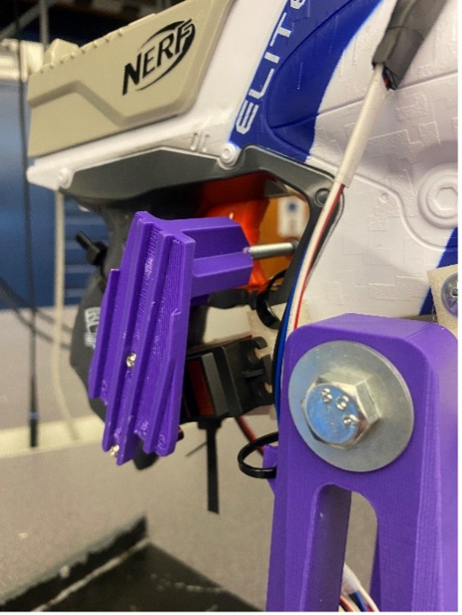
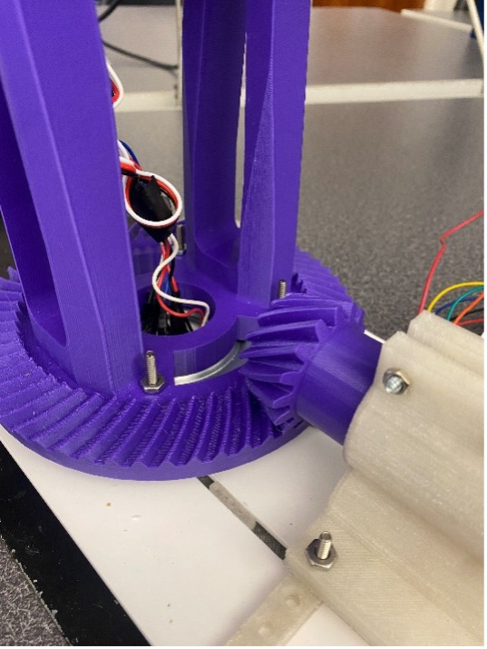
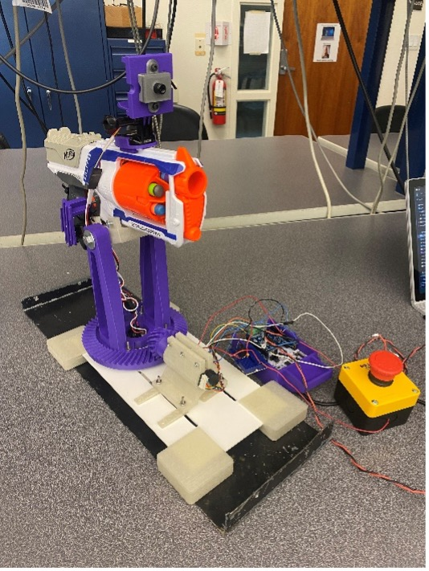
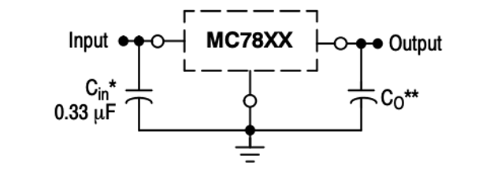
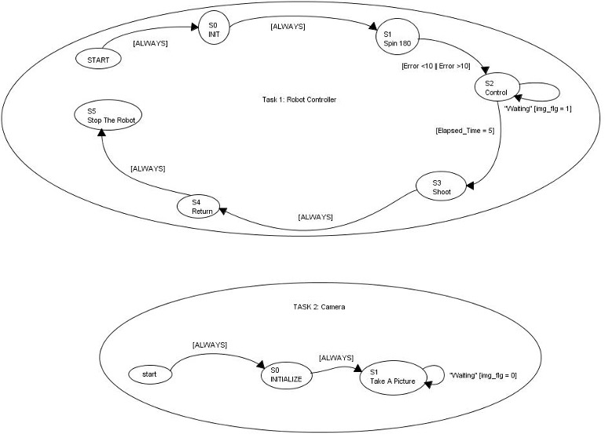

# Term-Project
Introduction 

This repository includes the code and documentation for the ME 405 Lab "Learn by Dueling" term project. The goal of this project was to create an automated foam dart turret to participate in a dueling competition. The turret had certain required functionality including the use of 1 brushed DC motor with encoder, another DC motor of the team's choice, and MLX90640 infrared camera supporting I2C communication. The turret is designed specifically for use in the ME 405 lab duel and operated by the team members. 

 

Hardware Design:  

The hardware system was designed to be robust and simple. Its main features include a panning axis controlled by a brushed DC motor with encoder feedback, a manually adjusted tilt secured by a bold, and servo-controlled trigger activation. The blaster used is a Nerf Strongarm revolving magazine and is manually cocked before each shot. The base is laser cut from 1/8th inch acrylic sheet and secures the motor and turntable relative to each other. The motor housing, gears, panning structure, camera mount, and trigger arm are 3D printed PLA. The camera was attached to the robot using the rail on the Nerf gun, along with 3D printed parts and a GoPro mount.  

Figure 1: SolidWorks model of the turret base with a built-in bevel gear for rotation 

 

Figure 2: Pinion for the assembly 

 

Figure 3: SolidWorks model of our Nerf gun mount  

 

Figure 4: SolidWorks model of our camera mount  

   

Figure 5. Trigger pull mechanism 

 

Figure 6. Panning axis mechanism. DC motor to panning structure on rotatory bearing.  

 

 

Figure 7. Entire hardware system 

Other hardware implementations include the addition of an emergency stop button and voltage regulator for the servo. The voltage regulator was used to supply the servo with 6V without the need for a second voltage source. The circuit was implemented as shown below with the input as 12V from the voltage source and the output to the servo.  

 

 
 

Source: https://www.mouser.com/datasheet/2/308/1/MC7800_D-2315963.pdf 

 

 

Software Design:   

The software includes a main file which implements cooperative multitasking and integrates all classes and functions created previously to use the hardware.  

The hardware classes are the encoder reader, motor drover, MLX cam, and servo driver. A PD controller class was created and used for the closed loop motor control.   

The main files include a camera task and a controller class which are implemented as finite state machines with cooperative multitasking using the task_share.py and cotask.py classes provided.  

The main file was designed around the finite state machines seen below. There were two main tasks in the file, one to control the turret and the other to take images with the camera.  The two tasks were designed to run through one cycle after the main program is run. 

 

Figure: 8. Finite State Machines for the two tasks. 

Results: 

The robot won lab section 05 single elimination dueling tournament by eliminating 3 opposing teams. In each successive round our accuracy increased as we changed the algorithm parameters. The scoring criteria are as follows: First team to hit=3 points, second team to hit=1 point, no shoot=0 points, miss=-1. In the first round we scored net 0 points, and the last round we scored a net 8 points in 5 rounds.  

The following day during open competition, our robot remained undefeated and successfully hit opposing teams 10/12 times.  

We learned that the most important aspect to competition success was refinement of the targeting algorithm. Through the closed loop motor control, the gun was able to aim very accurately where it “wanted” but having this setpoint agree with the human target location was difficult. To have the setpoint algorithm more accurately find the target, a few additions were made to the algorithm.  One included limiting the field of view of the camera to above the table and within the left and right edges. Also, a filter was applied to all thermal data to eliminate any values lower than 300 to reduce background noise affecting the targeting. Lastly, the final setpoint was calculated based on a 5 columns centroid calculation around the hottest column of thermal data.  

This project has a lot of potential for future work and development, including improvements to the cooperative multitasking for more continuous feedback and thermal data processing. Also, a tilt axis for a full range of aiming would be a great hardware improvement.  
